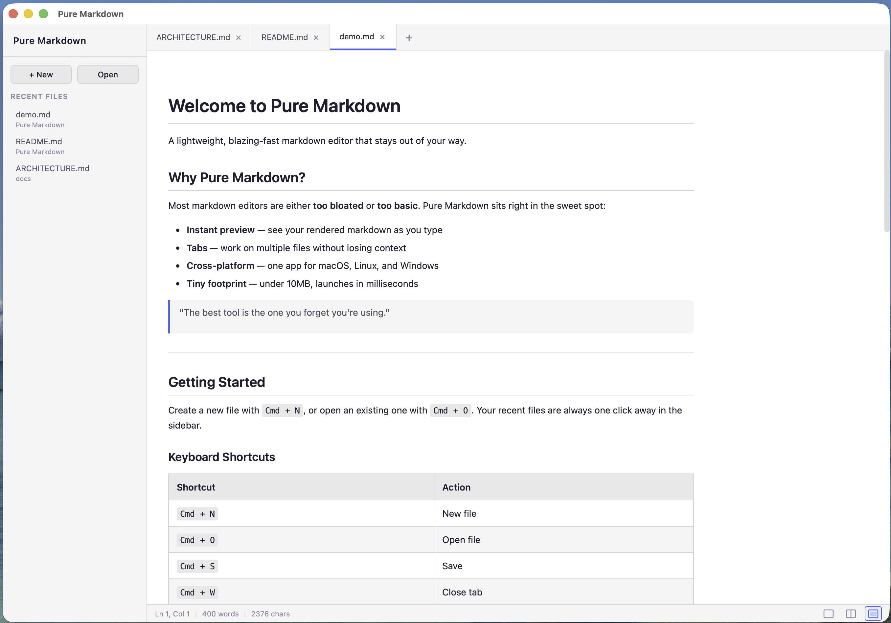
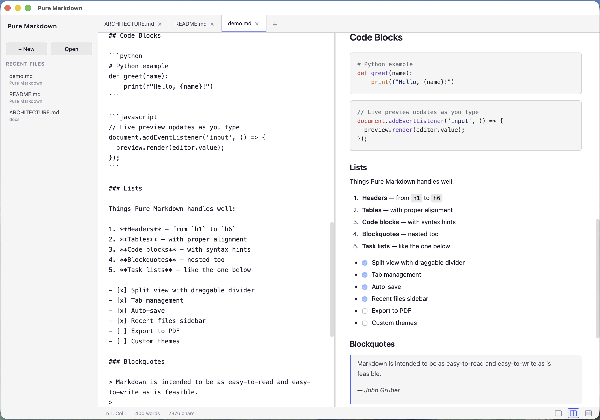
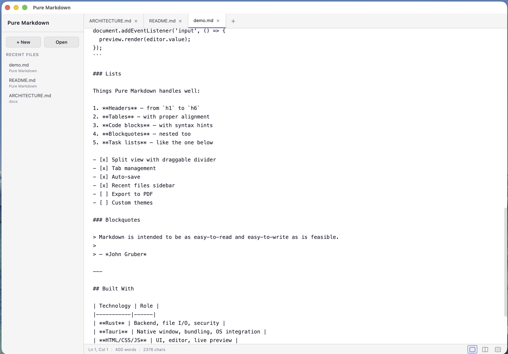
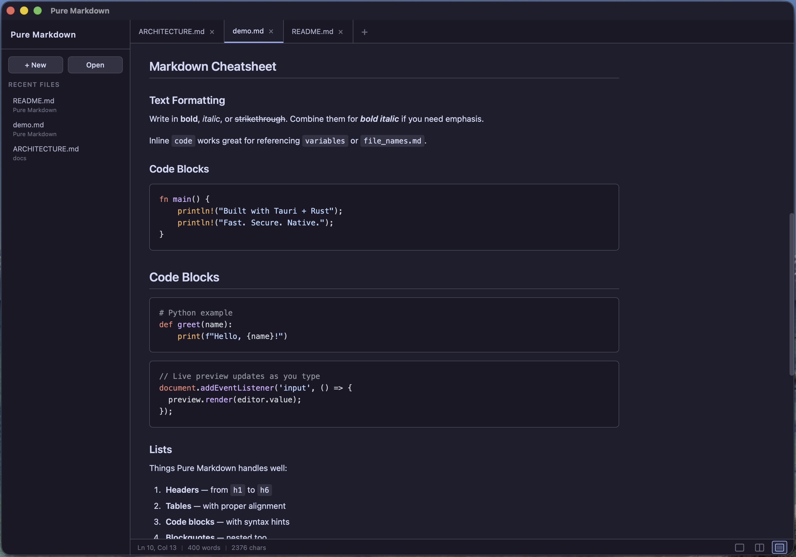
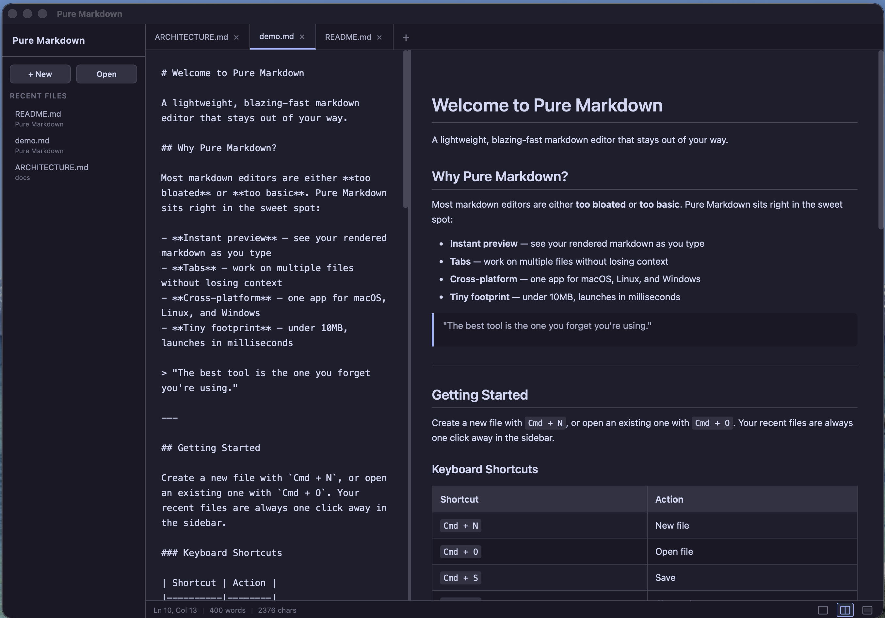
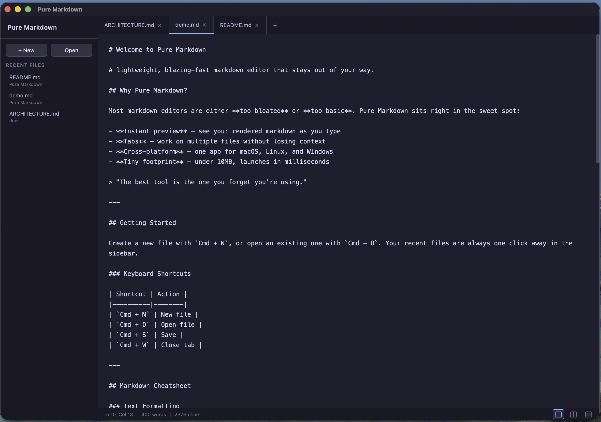

# Pure Markdown

A simple, fast, cross-platform markdown editor built with [Tauri](https://tauri.app/) (Rust + HTML/CSS/JS).

## Screenshots

| Mode | View | Image |
|:---:|:---:|:---:|
| Light | Preview Only |  |
| Light | Split View |  |
| Light | Editor Only |  |
| Dark | Preview Only |  |
| Dark | Split View |  |
| Dark | Editor Only |  |

## Features

- **Split view** with three modes: editor only, split, and preview only
- **Tabs** with session persistence -- unsaved tabs and content survive app restarts
- **Collapsible sidebar** with recent files list
- **Auto-save** with 2-second debounce for files saved to disk
- **Syntax highlighting** in code blocks via highlight.js (auto-detection and language hints)
- **KaTeX math rendering** for inline (`$...$`) and display (`$$...$$`) expressions
- **Dark/light theme** that follows system preference
- **Font size zoom** (in/out/reset) with persistence across sessions
- **Scroll sync** between editor and preview panes
- **Draggable splitter** between editor and preview
- **Word and character counter** in the status bar
- **Native macOS menu bar** with all shortcuts visible
- **Custom app icon**
- **File associations** for `.md`, `.markdown`, `.mdown`, and `.mkd`
- **Relative image resolution** in preview (paths resolve relative to the open file)
- **CLI support** -- open files by passing a path as an argument

## Keyboard Shortcuts

All shortcuts use `Cmd` on macOS and `Ctrl` on Windows/Linux.

### File Operations

| Shortcut | Action |
|----------|--------|
| `Cmd/Ctrl + N` | New file |
| `Cmd/Ctrl + O` | Open file |
| `Cmd/Ctrl + S` | Save file |
| `Cmd/Ctrl + W` | Close tab |

### Editing

| Shortcut | Action |
|----------|--------|
| `Cmd/Ctrl + Z` | Undo |
| `Cmd/Ctrl + Y` or `Cmd/Ctrl + Shift + Z` | Redo |
| `Cmd/Ctrl + B` | Bold |
| `Cmd/Ctrl + I` | Italic |
| `Cmd/Ctrl + E` | Inline code |
| `Cmd/Ctrl + Shift + E` | Code block |
| `Cmd/Ctrl + K` | Insert link |
| `Cmd/Ctrl + Shift + K` | Insert image |
| `Cmd/Ctrl + L` | Select line |
| `Cmd/Ctrl + D` | Duplicate line |
| `Cmd/Ctrl + Shift + Up` | Move line up |
| `Cmd/Ctrl + Shift + Down` | Move line down |
| `Tab` | Indent |
| `Shift + Tab` | Dedent |
| `Shift + Backspace` | Dedent current line |

### View

| Shortcut | Action |
|----------|--------|
| `Cmd/Ctrl + 1` | Editor only |
| `Cmd/Ctrl + 2` | Split view |
| `Cmd/Ctrl + 3` | Preview only |
| `Cmd/Ctrl + \` | Toggle sidebar |
| `Cmd/Ctrl + =` | Zoom in |
| `Cmd/Ctrl + -` | Zoom out |
| `Cmd/Ctrl + 0` | Reset zoom |

## Requirements

All platforms need:

- **Rust** (stable) -- [https://rustup.rs](https://rustup.rs)
- **Node.js** (LTS) -- [https://nodejs.org](https://nodejs.org) or via [nvm](https://github.com/nvm-sh/nvm)

### macOS

- Xcode Command Line Tools:
  ```bash
  xcode-select --install
  ```

### Linux (Ubuntu/Debian)

```bash
sudo apt update
sudo apt install -y libwebkit2gtk-4.1-dev build-essential curl wget file \
  libxdo-dev libssl-dev libayatana-appindicator3-dev librsvg2-dev
```

#### Fedora

```bash
sudo dnf install webkit2gtk4.1-devel openssl-devel curl wget file \
  libappindicator-gtk3-devel librsvg2-devel
```

#### Arch

```bash
sudo pacman -S webkit2gtk-4.1 base-devel curl wget file openssl \
  appmenu-gtk-module libappindicator-gtk3 librsvg
```

### Windows

- [Microsoft Visual Studio C++ Build Tools](https://visualstudio.microsoft.com/visual-cpp-build-tools/) -- install the "Desktop development with C++" workload
- [WebView2](https://developer.microsoft.com/en-us/microsoft-edge/webview2/) -- pre-installed on Windows 10 (1803+) and Windows 11

## Install Rust and Node.js

### macOS / Linux

```bash
# Rust
curl --proto '=https' --tlsv1.2 -sSf https://sh.rustup.rs | sh
source "$HOME/.cargo/env"

# Node.js (via nvm)
curl -o- https://raw.githubusercontent.com/nvm-sh/nvm/v0.40.1/install.sh | bash
source ~/.bashrc   # or source ~/.zshrc on macOS
nvm install --lts
```

### Windows

Download and run the installers:

- Rust: [https://rustup.rs](https://rustup.rs)
- Node.js: [https://nodejs.org](https://nodejs.org)

## Build

```bash
# Install dependencies
npm install

# Development (hot reload)
npm run tauri dev

# Production build
npm run tauri build
```

### Build output by platform

#### macOS

| Format | Location |
|--------|----------|
| `.app` | `src-tauri/target/release/bundle/macos/PureMarkdown.app` |
| `.dmg` | `src-tauri/target/release/bundle/dmg/PureMarkdown_0.1.0_aarch64.dmg` |

To build only the `.app`:

```bash
npx tauri build --bundles app
```

To build the `.dmg` installer:

```bash
npx tauri build --bundles dmg
```

To install, drag `PureMarkdown.app` into `/Applications`, or open the `.dmg` and drag from there.

#### Linux

| Format | Location |
|--------|----------|
| `.deb` | `src-tauri/target/release/bundle/deb/pure-markdown_0.1.0_amd64.deb` |
| `.rpm` | `src-tauri/target/release/bundle/rpm/pure-markdown-0.1.0-1.x86_64.rpm` |
| `.AppImage` | `src-tauri/target/release/bundle/appimage/pure-markdown_0.1.0_amd64.AppImage` |

To install:

```bash
# Debian/Ubuntu
sudo dpkg -i pure-markdown_0.1.0_amd64.deb

# Fedora/RHEL
sudo rpm -i pure-markdown-0.1.0-1.x86_64.rpm

# AppImage (any distro, no install needed)
chmod +x pure-markdown_0.1.0_amd64.AppImage
./pure-markdown_0.1.0_amd64.AppImage
```

The `.deb` and `.rpm` packages register the `.desktop` file with `MimeType=text/markdown`, so `.md` files can be opened with Pure Markdown from the file manager.

#### Windows

| Format | Location |
|--------|----------|
| `.msi` | `src-tauri/target/release/bundle/msi/PureMarkdown_0.1.0_x64_en-US.msi` |
| `.exe` (NSIS) | `src-tauri/target/release/bundle/nsis/PureMarkdown_0.1.0_x64-setup.exe` |

To install, run the `.msi` or `.exe` installer. Both register the file association for `.md` files in the Windows registry.

## Project Structure

```
PureMarkdown/
├── package.json                  # npm scripts and dependencies
├── src/                          # Frontend (HTML/CSS/JS)
│   ├── index.html
│   ├── styles/
│   │   ├── main.css              # Layout and theme (light/dark)
│   │   ├── editor.css            # Editor textarea
│   │   └── preview.css           # Rendered markdown
│   ├── js/
│   │   ├── app.js                # Bootstrap, shortcuts, event listeners
│   │   ├── state.js              # Central app state
│   │   ├── tabs.js               # Tab management
│   │   ├── editor.js             # Editor input, auto-save, splitter
│   │   ├── preview.js            # Markdown rendering (marked.js + highlight.js + KaTeX)
│   │   ├── fileops.js            # Open/save/create via Tauri APIs
│   │   └── sidebar.js            # Recent files list
│   └── vendor/
│       ├── marked.min.js         # Markdown parser
│       └── highlight.min.js      # Syntax highlighting
└── src-tauri/                    # Backend (Rust)
    ├── Cargo.toml
    ├── tauri.conf.json           # App config, bundle, file associations
    ├── capabilities/default.json # Security permissions
    └── src/
        ├── main.rs
        └── lib.rs                # Tauri commands, session, file-open events
```

## License

MIT
